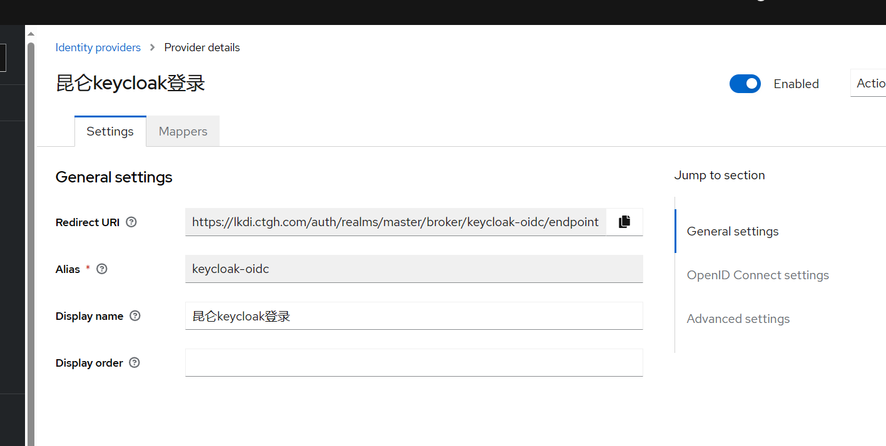
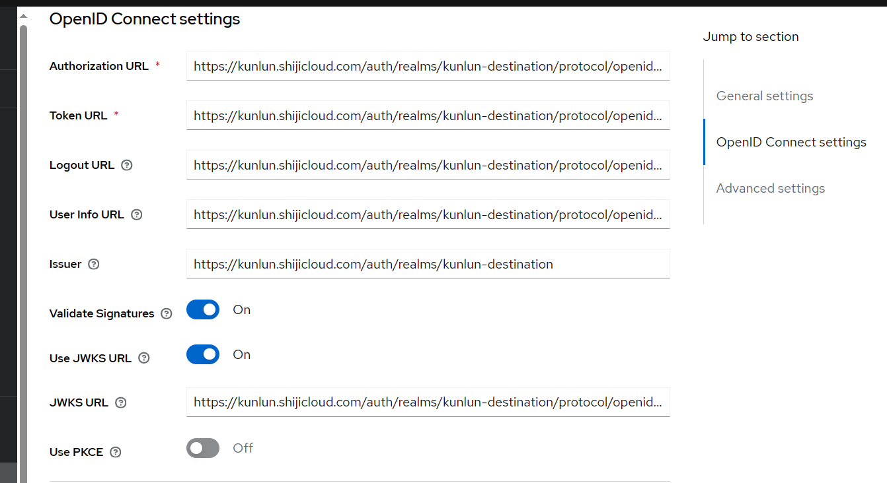
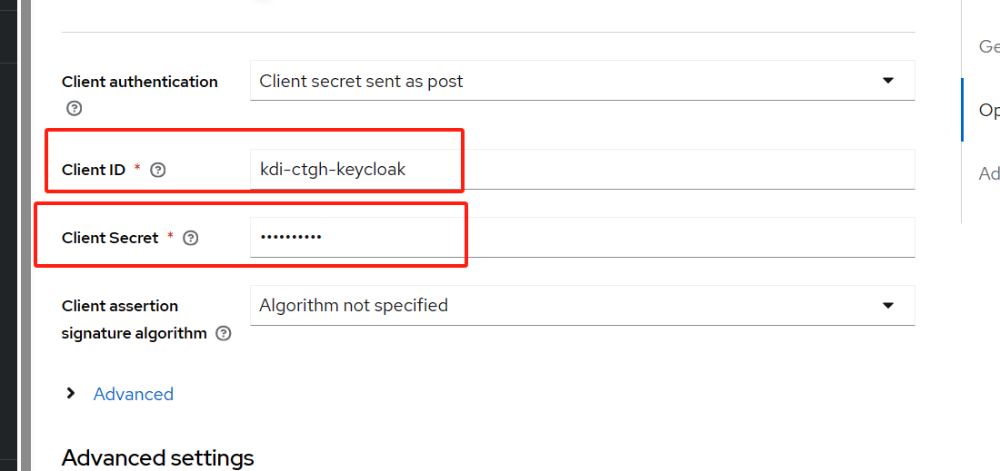
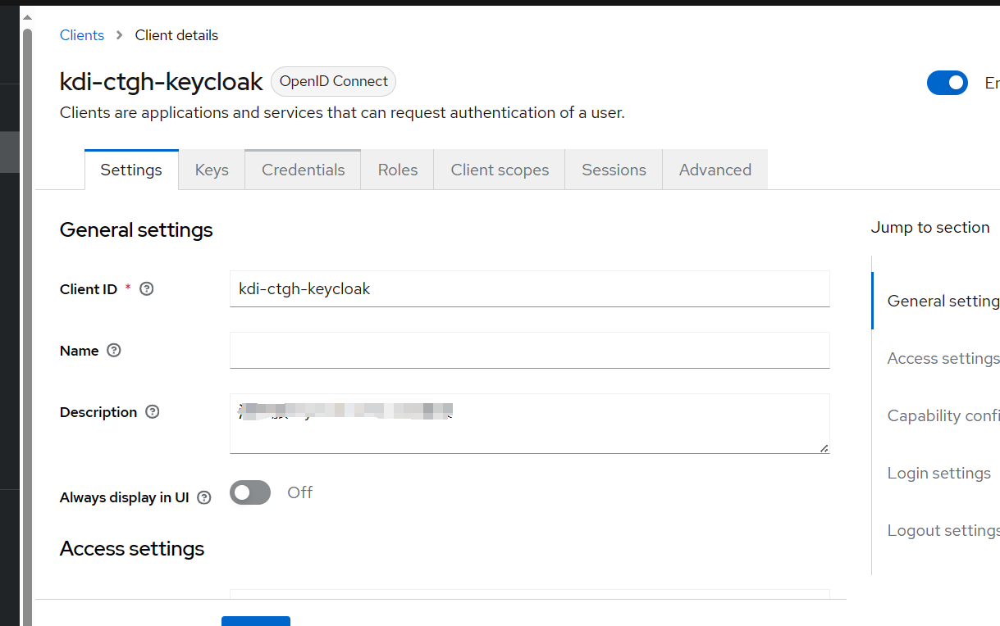
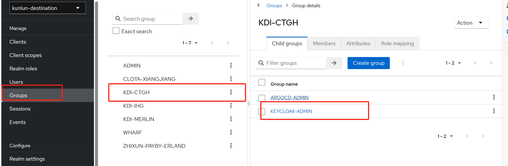
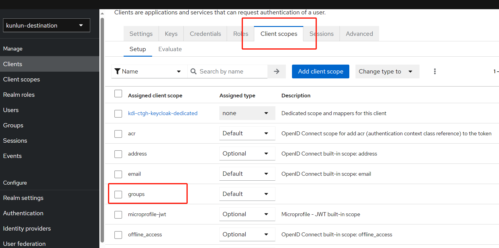
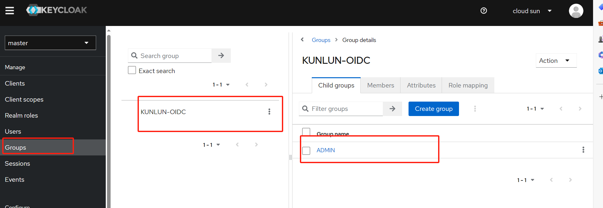
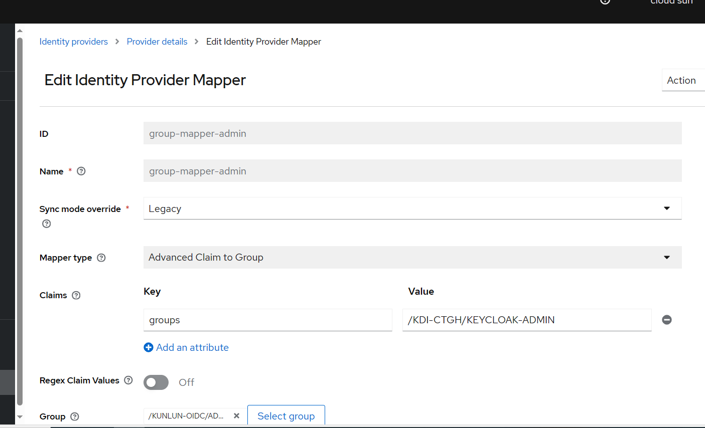
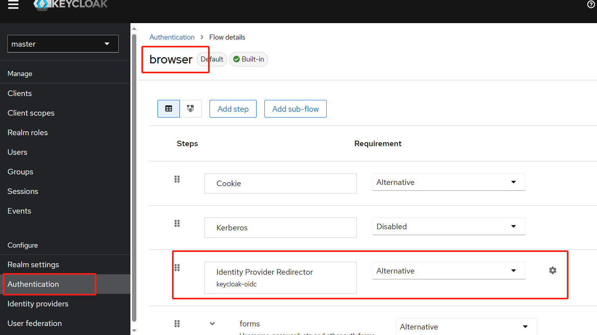
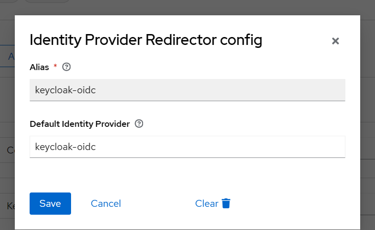

# keycloak配置oidc connect
keycloak配置oidc connect，即外部套一层已加密登录的keycloak来进行登录
## 1、配置Identity providers(源keycloak操作)

其中client ID和Client Secret来自已配置好的keyclaok
## 2、在示例的https://kunlun.shijicloud.com/auth/realm/kunlun-sso的keycloak进行配置(目标keycloak操作)

创建对应的groups

创建role

配置groups

## 3、配置mapper(在源keycloak操作)
创建groups

配置groups的admin权限

此时使groups进行权限的映射
## 4、配置登录默认跳转

default identity provider参数必须与idenity provider的Alias值一致